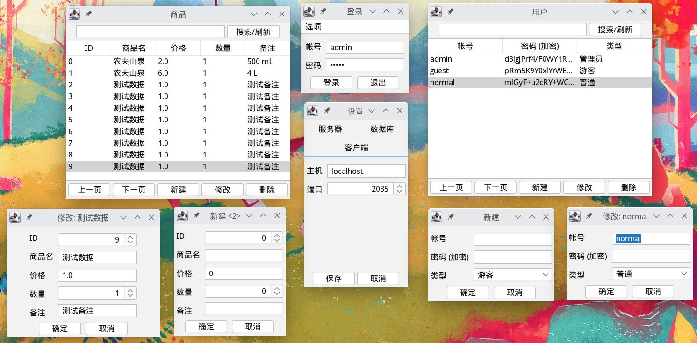
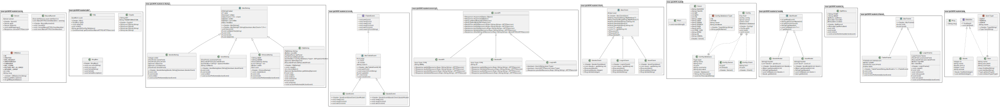

# 本分支为数据库课设更改版！

---

# 商品管理系统 —— Java 课程设计

本系统使用 **Java** 编写, 共分为 **客户端** 与 **服务端** 两大模块.

## 功能介绍

### 客户端

**客户端** 功能 **简单实用**, 界面 **简洁美观**. 用户在使用时, **只需运行编译打包好的 jar 文件**, 然后通过 **菜单栏** 的 **选项** → **设置** → **客户端** 配置 **要连接的服务器**
的 **主机地址** 和 **端口号**, 点击 **保存** 按钮后可以使用帐号密码登录. **登录成功** 则弹出 **管理项选择** 界面, 目前可选项为 **用户** 与 **商品**. 选择 **需要管理** 的管理项后,
会跳转到 **管理界面**, 可进行 **增, 删, 改, 查** 四项基本管理功能.

- ***增***

  点击 **新建** 按钮, 即可弹出 **对应管理项** 的 **新建对话框**, **填入数据** 后点击 **确定** 按钮, 即可新建一条数据.

- ***删***

  选中 **要删除的条目** , 点击的 **删除** 按钮即可删除对应条目.

- ***改***

  选中 **要修改的条目**, 点击的 **修改** 按钮, 即可弹出 **对应管理项** 的 **修改对话框**, 修改数据后点击 **确定** 按钮, 即可修改一条数据.

- ***查***

  本系统支持 **分页查询** 与 **关键词搜索**.

    - ***分页查询***

      进入管理界面默认显示 **第一页**, 点击 **上一页** 与 **下一页** 按钮可以翻页, **每页10条数据**.

    - ***关键词搜索***

      系统支持针对 **名字** (*用户名, 商品名等*) 的 **单个关键词搜索**, 在 **窗口上方** 的输入框输入 **要搜索的内容**, 点击右侧的 **搜索/刷新** 按钮即可.

    - ***刷新***

      系统支持 **重新请求数据** 来 **刷新**, 建议在 **增, 删, 改** 这类 **变更操作** 后点击 **搜索/刷新** 按钮刷新数据.

### 服务端

服务端搭建 **方便快捷**, 配置 **自由灵活**. 技术人员 ***(甚至是用户自身)*** **只需直接运行编译打包好的 jar 文件**, 然后通过 **菜单栏** 的 **选项** → **开启服务器** 来启动服务端.
服务端还具有 **如下特点**.

- ***配置灵活***

  服务端的配置均可从 **选项** → **设置** 中修改, 点击 **保存** 按钮后可以将配置保存到配置文件.

- ***支持多种数据库***

  目前支持使用 **H2** 和 **MySQL** 两种数据库, 其中 **H2** 数据库 **无需安装配置, 开箱即用**. *MySQL* 需**安装并执行 init.sql 脚本** 初始化.

- ***帐号权限管理***

  系统提供了 **三种帐号**, 分别为 **管理员, 普通用户, 游客**. 服务端 **限制** 了这三种帐号的 **权限**. 默认 **分别** 提供 **一个初始帐号** 用以 **初始化系统**.

    - ***管理员***

      **初始** 帐号密码 **均为 *admin***, 可以 **查看** 和 **编辑 用户** 和 **商品** 数据.

    - ***普通用户***

      **初始** 帐号密码 **均为 *normal***, **仅** 可以 **查看** 和 **编辑 商品** 数据.

    - ***游客***

      **初始** 帐号密码 **均为 *guest***, **仅** 可以 **查看 商品** 数据.

- ***高安全性***

    - **未登录** 帐号会 **禁止任何请求**, 防止 **越权** 操作.
    - 与客户端 **通信** 均进行 **加密** 处理, 确保数据 **传输** 的 **安全性**.
    - 密码保存使用 **帐号的密码** 作为 **加密密钥**, **仅** 在 **已知密码** 的情况下方可 **解密**, 降低 **密码泄露** 风险.
    - **配置文件** 中 **数据库密码 加密存储**, 降低 **密码泄露** 风险.
    - 针对 **高并发 限制线程数量**, 防止 **内存溢出** 使服务端 **崩溃**.
    - 查询数据库增加 **查询条件**, 防止 **全量查询** 导致 **内存溢出**, 使服务端 **崩溃**.

## 技术实现

本系统设计的 **核心** 出发点为 **安全**, 主要针对 **各种安全问题**, 使用了 **相应的技术** 来应对.

### 数据库连接信息

普通的管理系统大多采用 **JDBC 直接连接数据库** 的方式, 将 **数据库** 的 **连接信息** (*如 **地址, 端口, 帐号, 密码** 等*) **直接写入用户端**, 这些信息可以很轻松的通过 **反编译程序获得**,
而得到这些信息便可 **直接连接数据库, 任意篡改数据**. 本系统为了应对, 设计为 **客户端与服务端分离** 的模式, 将数据库的连接信息 **保护在服务端**, 客户端 **只能** 通过服务端 **间接访问数据库**,
而在服务端增加了种种 **限制** 与 **验证**, 防止 **未授权请求越权操作**, 保护数据库数据的 **安全性** 与 **可靠性**.

### 客户端与服务端通信

客户端与服务端之间使用 **HTTP 协议** 通信, 在服务端使用了 **NanoHTTPD
框架** *([https://github.com/NanoHttpd/nanohttpd](https://github.com/NanoHttpd/nanohttpd))* 来建立HTTP服务器, 并使用 **线程池** 来
**限制线程数量**, 以应对 **高并发** 场景. 在客户端使用 **MiniHTTP-Client
框架** *([https://github.com/itgowo/MiniHttpClient](https://github.com/itgowo/MiniHttpClient))* 来发送请求. 通信模式尽可能的遵循
**RESTful 风格** *([https://restfulapi.cn/](https://restfulapi.cn/))* 通信内容使用 **fastjson** 序列化, 并通过
**AES/ECB/PKCS5Padding**
加密算法进行 **私有密钥对** 加密, 数据传输 **安全可靠**.

### 访问数据库

普通的 **字符串拼接SQL语句** 方式存在 **SQL注入** 这一 **巨大安全隐患**, 本系统服务端访问数据库采用 **Bee
框架** *([https://gitee.com/automvc/bee](https://gitee.com/automvc/bee))*, 对接收到的参数先进行 **有效性检查**, 尽可能的 **避免SQL注入**.

### 架构设计

- 整体尽可能的遵循 **MVC 架构** 设计, 将 **数据, 控制, 界面** 三者进行 **分离**, 方便程序 **后续维护**.
- 较多的运用了 **抽象类, 接口, 泛型** 等 **Java 基本特性**, 为未来可能存在的 **功能拓展 预留空间**.
- 较多的运用了 **单例模式, 适配器模式** 等 **设计模式**, 提高代码的 **可靠性** 与 **逻辑性**.
- 为 HTTP **预留了相应的接口**, 可以 **快速的实现浏览器端**. *~~(原本计划制作, 但由于时间不足, 没能来得及, 故仅预留了相关接口)~~*
- **Getter, Setter** 使用 **Lombok** 进行简化

### UI 设计

为提高 UI **美观性**, 使用了 **FlatLaf 主题**. UI均为 **响应式布局**, 可根据用户对界面的 **缩放 自动调整**.

### 可以优化的点

1. 类之间 **耦合性较强**, 考虑使用 **多种设计模式** 进行 **解藕**.
2. 部分逻辑 **高度相似** 甚至 **重复**, 考虑 **提取超类** 或 **抽象化** 处理.
3. UI 进一步优化, 增加一些风格匹配的 **图标**, 增强 **交互性**.
4. 增加 **用户注册** 功能 *(由于程序架构内 **预留** 了相关的 **拓展空间**, 可 **轻松实现**, ~~但时间不足, 来不及制作~~)*
5. 增加 **商品出售** 功能 *(同上)*
6. 迁移到 **Kotlin** 实现 *(Ktor + Exposed + Coroutines + Kotlinx.Serialization + Gradle)*

## 运行截图

## UML 图

关系线有缺失,
如果显示异常请查看 [doc/uml.svg](https://external.githubfast.com/https/raw.githubusercontent.com/QiE2035/java_class_design/master/doc/uml.svg)
或 [doc/uml.jpg](doc/uml.jpg)

